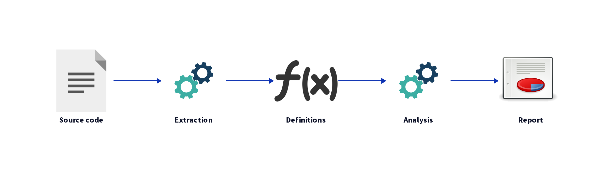
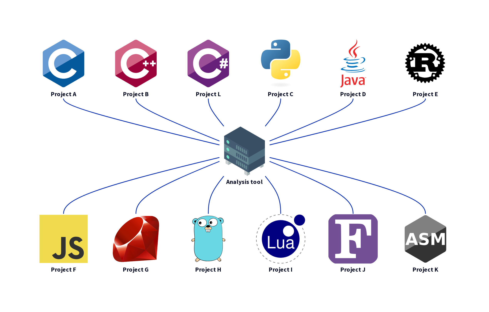
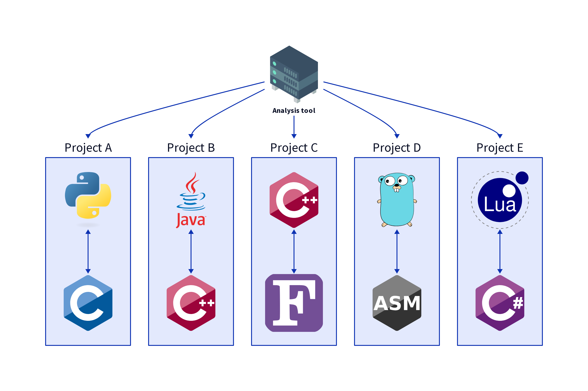
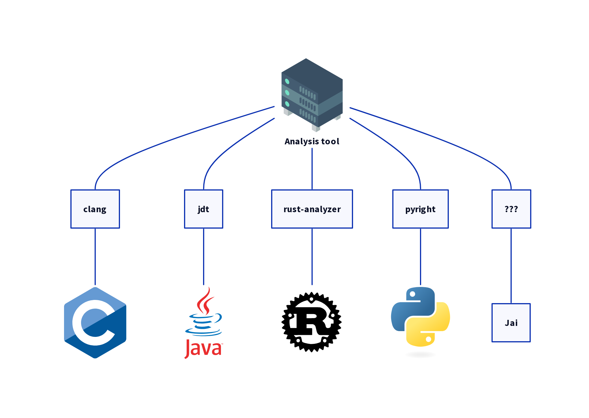
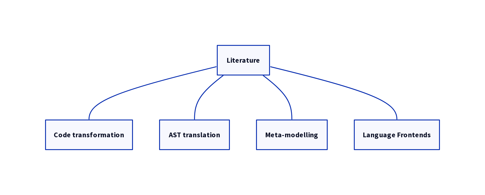
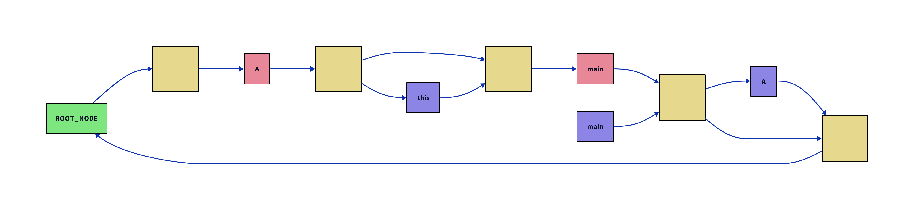
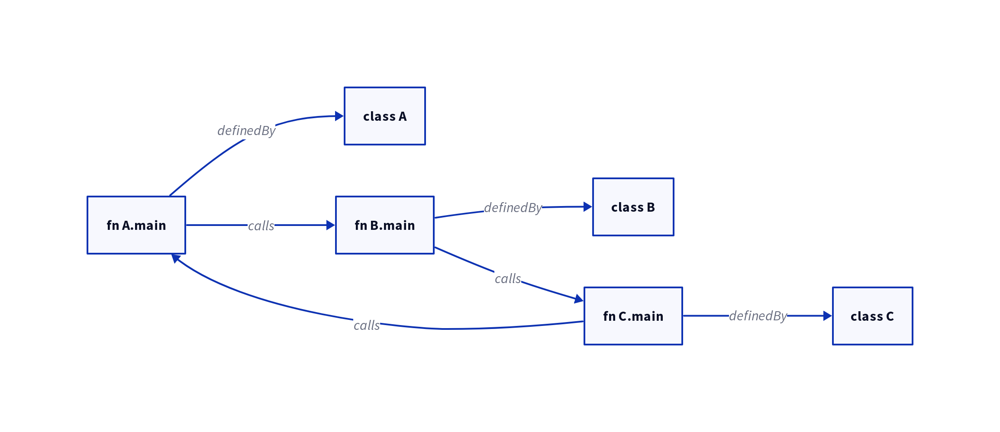
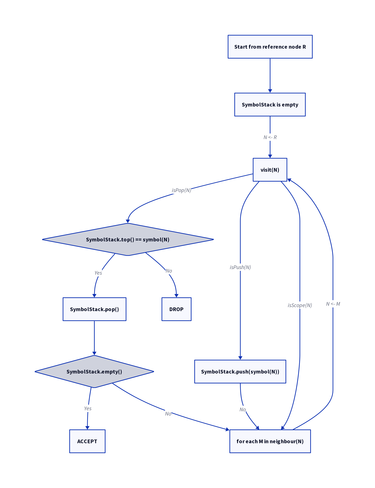

# Images

# software-analysis-tools.png

# the-tedious-detail-1.png

# the-tedious-detail-2.png

# naive-solution.png

# techniques.png

# stack-graph-example.png

# dependency-graph-example.png

# reference-resolution-algorithm.png

