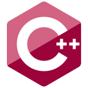

# Images

| Icon | Source |
| ---- | ------ |
| function.png | https://storage.needpix.com/rsynced_images/math-27248_1280.png |
| file.svg | https://commons.wikimedia.org/wiki/File:Icon-txt.svg |
| gears.png | https://commons.wikimedia.org/wiki/File:Two-gear-icon.png |
| report.svg | https://commons.wikimedia.org/wiki/File:Report.svg |
| lua.svg | https://commons.wikimedia.org/wiki/File:Lua-Logo.svg |
| asm.svg | https://raw.githubusercontent.com/tushev/tushev/main/assets/icons-orig/asm.svg |
| fortran.svg | https://en.wikipedia.org/wiki/File:Fortran_logo.svg |
| cpp.svg | https://icons.terrastruct.com |
| csharp.svg | https://icons.terrastruct.com |
| c.svg | https://icons.terrastruct.com |
| go.svg | https://icons.terrastruct.com |
| java.svg | https://icons.terrastruct.com |
| js.svg | https://icons.terrastruct.com |
| python.svg | https://icons.terrastruct.com |
| ruby.svg | https://icons.terrastruct.com |
| rust.svg | https://icons.terrastruct.com |
| server.svg | https://icons.terrastruct.com |

# function.png

# file.svg

# gears.png

# report.svg 

# cpp.svg

# csharp.svg

# c.svg

# go.svg

# java.svg

# js.svg

# python.svg

# ruby.svg

# rust.svg

# lua.svg

# fortran.svg

# asm.svg

# server.svg

